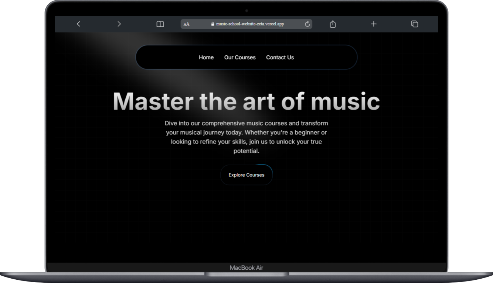
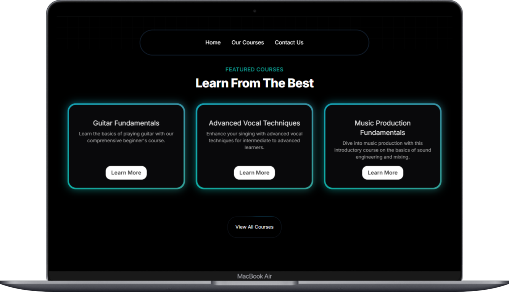
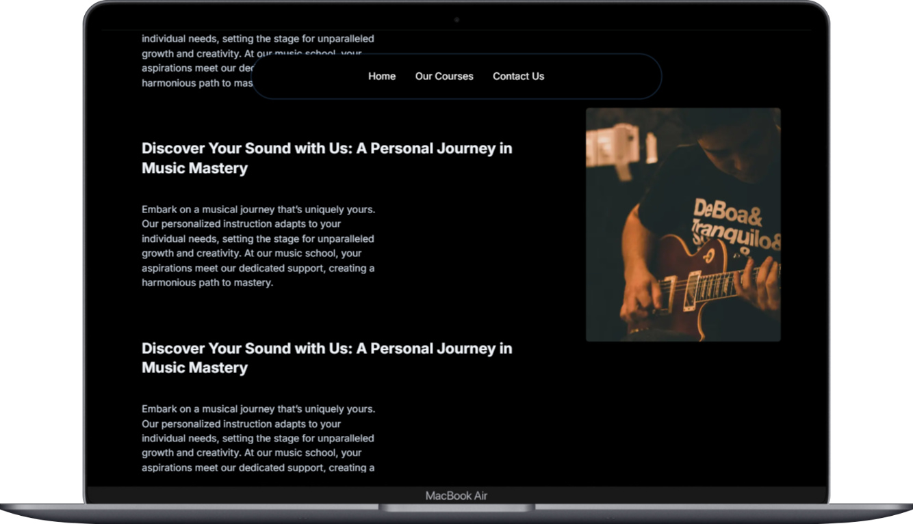
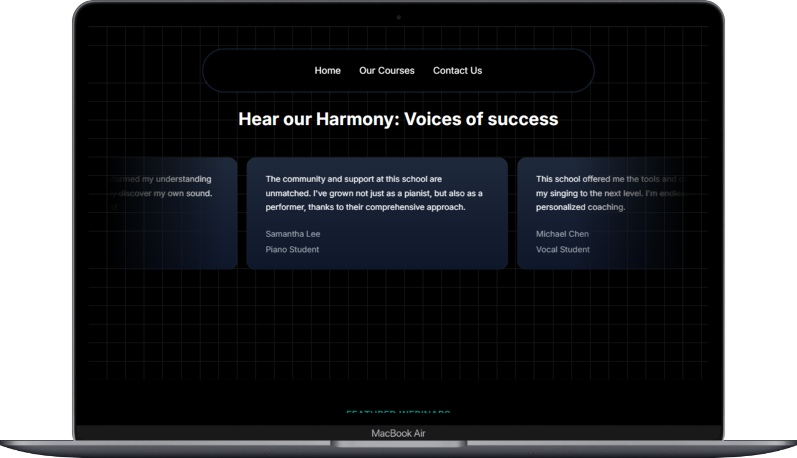
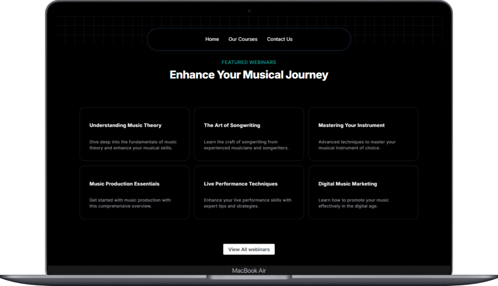
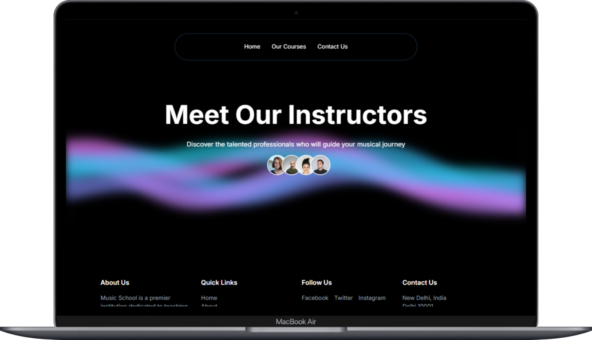
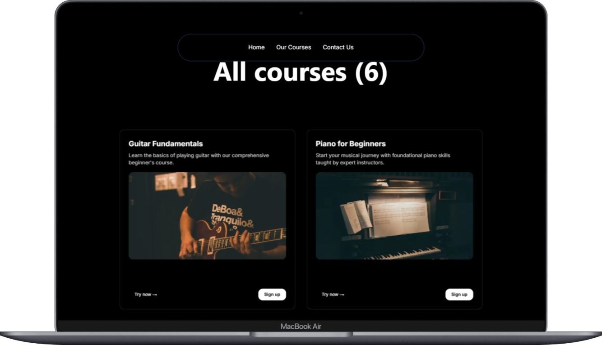

<h1 align="center"> 🎶 Musix: A Music Course Selling App</h1>
    <p align="center"><em>A modern music school course selling page.</em></p>

<h2>📖 Table of Contents</h2>
    <ul>
        <li><a href="#overview">Overview</a></li>
        <li><a href="#features">Features</a></li>
        <li><a href="#screenshots">Screenshots</a></li>
        <li><a href="#installation">Installation</a></li>
        <!-- <li><a href="#usage">Usage</a></li> -->
        <li><a href="#contributing">Contributing</a></li>
        <!-- <li><a href="#license">License</a></li> -->
        <li><a href="#acknowledgments">Acknowledgments</a></li>
        <li><a href="#contact">Contact</a></li>
    </ul>

<h2 id="overview">🔍 Overview</h2>
<p>
    A modern music school landing page built using <strong>Next.js</strong> and <strong>Aceternity UI</strong>. It showcases available music courses, instructors, and a beautifully designed homepage using clean components and animations.   
</p>
<h2 id="features">✨ Features</h2>
<ul>
    <li> 🎸 Beautifully designed landing page.</li>
    <li>📚 Featured courses section.</li>
    <li>🧑‍🏫 Instructor highlights and featured webinar section</li>
    <li>🌟 Review/testimonial section for social proof  </li>
    <li>⚡ Built with Aceternity UI animations and components.</li>
    <li>📱 Fully responsive on all devices.</li>

</ul>

<h2 id="screenshots">📸 Screenshots</h2>

<h4>Dashboard Preview</h4>


<h4>Featured Courses Page</h4>


<h4>Description Page</h4>


<h4>Testimonial Page</h4>


<h4>Webinar Page</h4>

<h4>Instructor Page</h4>


<h4>Courses Page</h4>



<h2 id="installation">⚙ Installation</h2>

```
# Clone the repository
git clone https://github.com/Subhradeep1708/Music-School-Website

cd Music-School-Website

# Install Dependencies
npm install

# Run the development Server
npm run dev
```

<!-- <h2 id="usage">🚀 Usage</h2>
<ol>
    <li>Register as a donor or recipient with medical credentials.</li>
    <li>The system automatically matches donors/recipients using the scoring algorithm.</li>
    <li>Generative AI analyzes compatibility and generates risk/success reports.</li>
    <li>Receive real-time alerts for matches via email/SMS.</li>
    <li>Access the dashboard to view analytics and manage donations.</li>
</ol> -->
<!--  -->
<h2 id="contributing">👥 Contributing</h2>
<p>Contributions are welcome! Follow these steps:</p>
<ol>
    <li>Fork the repository.</li>
    <li>Create a feature branch (<code>git checkout -b feature/AmazingFeature</code>).</li>
    <li>Commit changes (<code>git commit -m 'Add AmazingFeature'</code>).</li>
    <li>Push to the branch (<code>git push origin feature/AmazingFeature</code>).</li>
    <li>Open a Pull Request.</li>
</ol>

<!-- <h2 id="license">📜 License</h2>
<p>Distributed under the MIT License. See <code>LICENSE</code> for details.</p>
 -->

<h2 id="acknowledgments">🙏 Acknowledgments</h2>
<ul>
    <li>UI Framework: Next.js, Aceternity UI, TailwindCSS</li>
</ul>
<h2 id="contact">📞 Contact</h2>
<p>
    Project Maintainers: 
    <a href="mailto:subhradeep1708@gmail.com">subhradeep1708@gmail.com</a><br>
    GitHub: <a href="https://github.com/Subhradeep1708">@Subhradeep1708</a>
</p>
